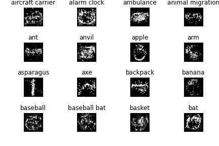

cGAN transfer learning code:
https://github.com/eriklindernoren/Keras-GAN

# Deep Learning Final Project
* Due Friday 12/4

## Milestones (Links to an external site.)
* ~Pick group members and problem: Monday 11/9~
* ~Last day to define and obtain data for a problem: Wednesday 11/11~
* Last day to present first version that does better than a baseline: Monday 11/16
* Last day to present improved second version: Monday 11/23
* Last day to turn last version and the project report: Friday 12/4

## Problem constraints (Links to an external site.)
* Data can be text, images, sound, video, sensor data, etc. or a mixture for multimodal learning problems
* Can download existing datasets from published literature or Kaggle
* Problems can be classification, regression, or other problems presented in the literature, e.g. (semantic segmentation)
* Cannot pick a binary classification problem
* Cannot pick datasets used before, i.e. MNIST, Fashion MNIST, CIFAR 10, CIFAR 100

## Neural network model constraints (Links to an external site.)
* The first version (that does better than a specified baseline) must be implemented and trained from scratch
* Subsequent versions can build upon existing models (VGG, ResNet, Inception, etc.) and apply transfer learning

## Final report (Links to an external site.)
* Organized as learned in Project 1: title, authors, background, methodology, results, analysis and discussion, references
* Maximum 6 pages
* Turn in code separately as Jupyter Notebook

## Grading criteria (Links to an external site.)
* Demonstrates proficiency in the methodical solution of machine learning problems
* Demonstrates clear reasoning and critical thinking
* Provides reasonable written analysis and supplementary evidence
* Appropriately cites other's work and ideas
* Demonstrates work by all members of the team

## Graduate students (Links to an external site.)
* Graduate students are allowed to work with undergraduate students as part of the same team
* Graduate students must also contribute a"Related Work" section to final report. 
> The Related Work section should be between 1 to 2 pages, frame the project within the context of what's been done in the literature, and provide an overview of the key publications in the field. The bulk of the citations for the report should be in this section.
